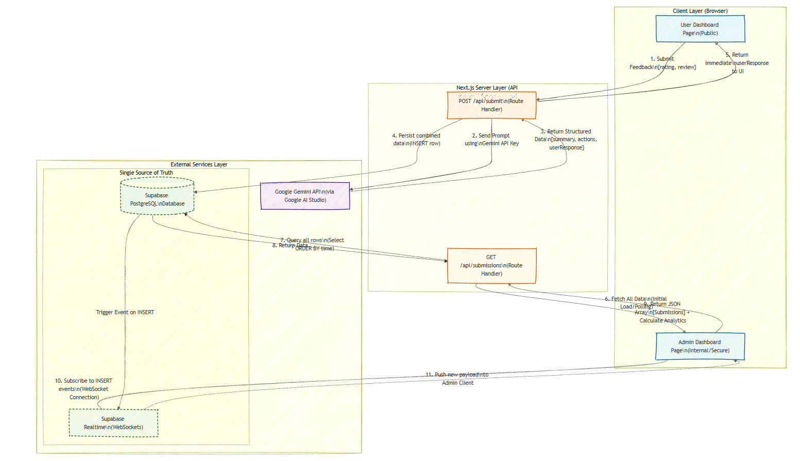

# Assignment Tasks

## Task 1: Yelp Review Classification
Located in `task1_analysis.ipynb`.  
Run the notebook to see Zero-Shot, Few-Shot, and Chain-of-Thought prompting strategies using **Gemini 2.5 Flash**.

## Task 2: AI Feedback System (Web App)
Located in `feedback-app/`.  
A Next.js 14 app with **Shadcn UI**, **Supabase** integration, and **Recharts** for analytics.

### Setup
1. `cd feedback-app`
2. `npm install`
3. Copy `.env.example` to `.env.local` and fill in your keys:
   - `GEMINI_API_KEY`: For AI analysis (uses **Gemini 2.5 Flash**).
   - `NEXT_PUBLIC_SUPABASE_URL`: From your Supabase project settings.
   - `NEXT_PUBLIC_SUPABASE_ANON_KEY`: From your Supabase project settings.

### Supabase Schema
Run this SQL in your Supabase SQL Editor to create the table:
```sql
create table feedback (
  id uuid default gen_random_uuid() primary key,
  rating int not null,
  review text not null,
  "aiResponse" jsonb,
  timestamp timestamptz default now()
);
```

### Running the App
- `npm run dev`
- User Dashboard: `http://localhost:3000`
- Admin Dashboard: `http://localhost:3000/admin`

### Features
- **UI**: Modern, responsive design using Shadcn UI (Cards, Buttons, Inputs).
- **Analytics**: Interactive analytics dashboard with Recharts:
  - Sentiment Gauge (real-time satisfaction score)
  - Keyword Cloud (frequent words in reviews)
  - Rating Distribution (bar chart)
  - Submission Volume Trend (area chart)
  - Average Rating Over Time (line chart)
  - Weekly Activity Heatmap (day-of-week analysis)
  - AI Response Performance KPIs
- **Storage**: Hybrid store (Supabase primary, local JSON fallback).
- **AI**: Gemini 2.5 Flash integration for sentiment response and actionable items.

## Flow Diagram of Task 2

